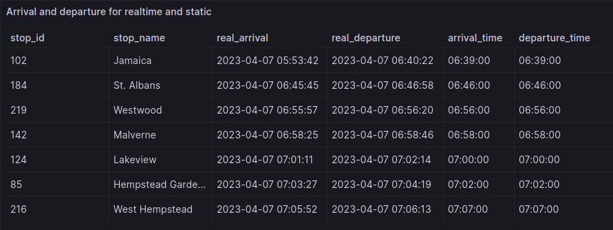

This section contains some of the possibilities with public transport data and MobilityDB. The visualisations are obtained with the creation of a Grafana dashboard. The maps visualisations are obtained using MOVE on QGIS.

## Closest Line to a Point of Interest
This query compute the closest line from the public transport network to a point of interest, New York Long Island Rail Road and Times Square here. 

## Average Speed of Vehicles by Day or Hour

This queries compute the average speed of our vehicles. Here average speed of New York buses.

## Compute Delay between Static and Realtime Feed

This query compute the average delay by line on the time range defined by the dataset. It allows to identify the most late lines.

## Static Visualisation of Delays by Line (Heatmaps)
This query builds 5 heatmaps according to arbitrary distance. Here 100m, 50m, 25m, 10m and 5m.

## Dynamic Visualisation of Delays by Line
Using a dynamic visualisation tool for MobilityDB like MOVE on QGIS allows to watch the different public transports runs. The following visualisation shows the journey of a realtime catched train, and its theoretical trip extracted from the GTFS Static feed. In blue the theoretical train, and in red the train catched in realtime.

## Compute Static and Realtime Arrival and Departure Times

The more precise information we can get about delays are the arrival and departure times at stops. This query compute this information.

## Export Stop Times from MobilityDB

After building or editing trips with MobilityDB, we can export a time table (GTFS Static format) the same way we built the arrival and departure times. The query allows to export a <code>stop_times.txt</code> file. 

## City Area Coverage

This case is inspired by the article by [Nishino et al.](https://www.mdpi.com/2071-1050/13/23/13471) In this paper, they
try to calculate the percentage of the population that could be alerted if
a calamity occurred at a given time <code>t</code> in the city of Brisbane using GTFS Realtime Data.

The example here uses the realtime positions of buses in Brooklyn to see which percentage of surface we could alert on April 8, 2023, at 09:50:00.

## City Public Transport Trafic Visualisation

Once all the data from a city is stored in MobilityDB, we can use a visualisation tool and explore the city. The example here shows Brussels on July 21, 2023, in the morning. The different coloured dots represent the companies' means of transport. STIB-MIVB, the main transport company in Brussels, is represented by the blue dots, De Lijn in yellow, TEC in red, and SNCB in green.

